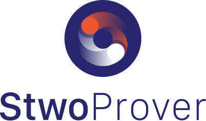

# 🌟 STWO WASM Demo: Fibonacci Proof in Your Browser! 🌟

<div align="center">



[](https://opensource.org/licenses/Apache-2.0)
[](https://www.rust-lang.org)
[](https://webassembly.org/)

[🚀 Live Demo](https://AbdelStark.github.io/stwo-wasm-demo) | [📘 STWO Documentation](https://github.com/starkware-libs/stwo)

</div>

## 🎉 Welcome to the STWO WASM Demo!

Experience the power of STARK proofs right in your browser! This demo showcases the Fibonacci example from the STWO next generation prover, compiled to WebAssembly for lightning-fast, client-side execution.

Client-side proving made easy.

### 🔍 What's Inside?

- 🧮 **Fibonacci Proof Generation**: Watch as complex mathematical proofs are generated in real-time.
- ✅ **Proof Verification**: See the verification process in action.
- 🎛️ **Interactive Interface**: Play with different parameters and see how they affect the proofs.
- 🚀 **WASM-powered**: Experience the speed of native-like performance in your browser.

## 🚀 Getting Started

1. **Visit the [Live Demo](https://yourusername.github.io/stwo-wasm-demo)**
2. Choose a predefined case or input your own parameters
3. Click "Run" and watch the magic happen!

## 🛠️ Local Development

Want to tinker with the code? Here's how to set it up locally:

```bash
# Clone the repository
git clone https://github.com/AbdelStark/stwo-wasm-demo.git
cd stwo-wasm-demo

# Install wasm-pack if you haven't already
cargo install wasm-pack

# Build the WASM module
wasm-pack build --target web

# Serve the files locally (you can use any local server)
python -m http.server

# Open http://localhost:8000 in your browser
```

## 🧪 Features

- **Predefined Test Cases**: Quick examples of successful and failed proofs.
- **Custom Input**: Experiment with your own log sizes and claims.
- **Real-time Feedback**: Instant results displayed in a user-friendly format.

## 🤝 Contributing

We love contributions! If you have ideas for improvements or find any issues, please open an issue or submit a pull request.

## 📜 License

This project is licensed under the MIT License - see the [LICENSE](LICENSE) file for details.

## 🙏 Acknowledgements

This demo is powered by the amazing [STWO Prover](https://github.com/starkware-libs/stwo) from StarkWare. A big thank you to the StarkWare team and all contributors!